# Neural Network Charity Analysis

## Overview of the Analysis
The purpose of this project is to create a binary classifier that is capable of predicting whether applicants will be successful if funded by Alphabet Soup.

## Data Fields
The Customer provided the a CSV file named "charity_data.csv" with the following fields.
* EIN and NAME—Identification columns
* APPLICATION_TYPE—Alphabet Soup application type
* AFFILIATION—Affiliated sector of industry
* CLASSIFICATION—Government organization classification
* USE_CASE—Use case for funding
* ORGANIZATION—Organization type
* STATUS—Active status
* INCOME_AMT—Income classification
* SPECIAL_CONSIDERATIONS—Special consideration for application
* ASK_AMT—Funding amount requested
* IS_SUCCESSFUL—Was the money used effectively

## Results
### Data Preprocessing
* Target Variable: IS_SUCCESSFUL
* Model Features: NAME, APPLICATION_TYPE, AFFILIATION, CLASSIFICATION, USE_CASE, ORGANIZATION, INCOME_AMT, ASK_AMT
* Non-Beneficial Fields Removed
    * EIN: The definition of the field, Employer Identification Number, is not a meaningful classifier.
    * STATUS: Field does not contain enough balance in the two values that it has. 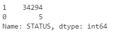
    * SPECIAL_CONSIDERATIONS: Field does not contain enough balance in the two values that it has. 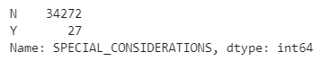
* Fields Requiring Binning (10 or More Value Types)
    * APPLICATION_TYPE: Field contained 15 value types. A cutoff point binning was set for any values that contains a count of less than 500. 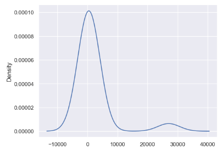
    * CLASSIFICATION: Field contained 71 value types. A cutoff point binning was set for any values that contains a count of less than 1,000. 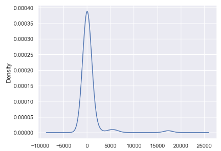
    * NAME: Field contained 19,568 value types. A cutoff point binning was set for any values that contains a count of 5 or less. 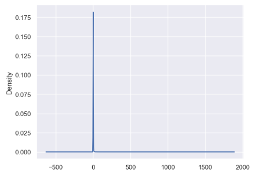
* Field Encoding: OneHotEncoder was used to convert fields with a datatype of "OBJECT" to a numeric value. 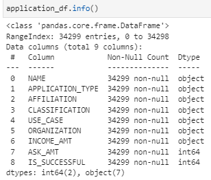
* Training and Test data was scaled using the StandardScaler method.

### Compiling, Training, and Evaluating the Model
To achieve 78.69% accuracy, surpassing the goal of 75%, the model was optimized four (4) times.
* D2 - Original Model (72.57%)
    * EIN and NAME were removed, APPLICATION_TYPE and CLASSIFICATION were binned, data was encoded and scaled, two (2) hidden layers using the RELU activation functions were applied followed by a SIGMOID outer layer. Original X_Train data has 43 features. Rule of the is to apply 2 to 3 times the number of neurons.
    * Layers, Activation Functions and Neurons Summary 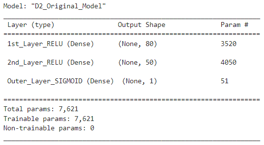
    * 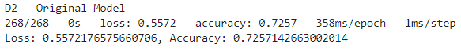
    * 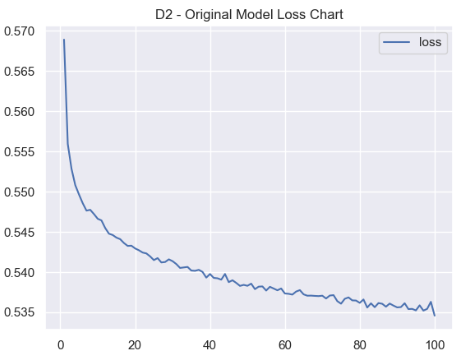
    * 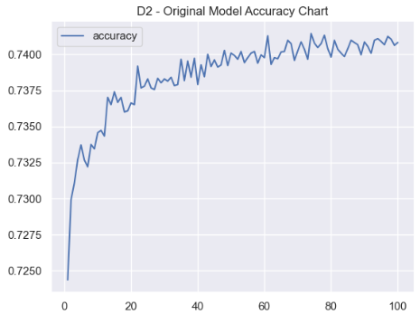
* D3 - Optimization 1 Model (72.72%)
    * Optimization Changes: Original model did not achieve 75% or more accuracy, further features of little impact such has STATUS and SPECIAL_CONSIDERATIONS were removed. A 3rd layer using the RELU activiation function was added.
    * 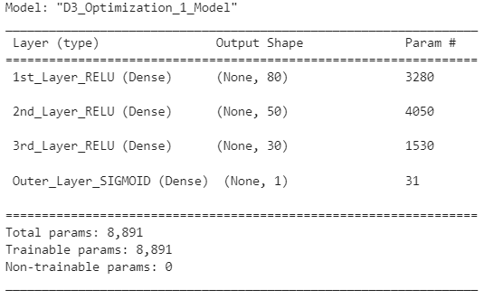
    * 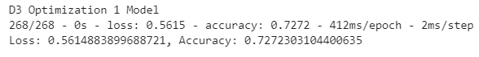
    * 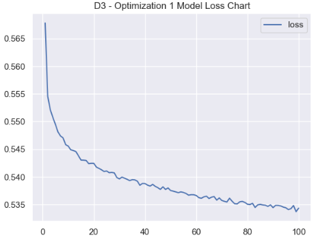
    * 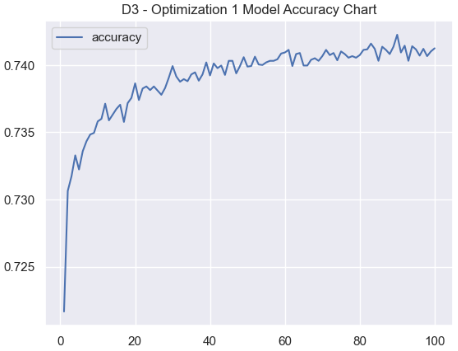
* D3 - Optimization 2 Model (72.55%)
    * Optimization Changes: D3_Optimization 1 Model did not achieve 75% or more accuracy. Infact, the accuracy reduced slightly. All changes from the previous D3_OPT_1 model were kept with the exception of the activation method. The activation method for the 2nd and 3rd layers were changed from RELU to SIGMOID.
    * 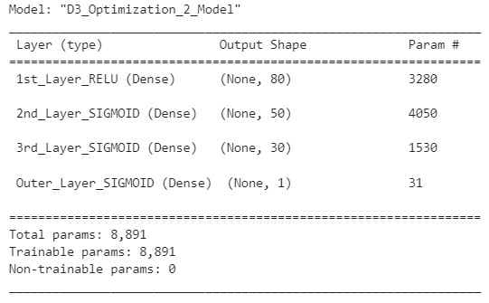
    * 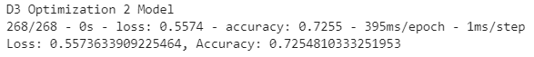
    * 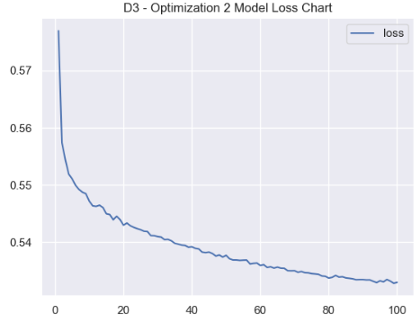
    * 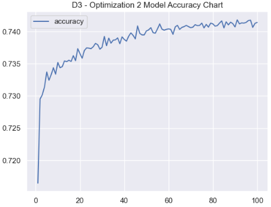
* D3 - Optimization 3 Model (74.13%)
    * Optimization Changes: The changes from the previous D3_OPT_2 model slight further deteriorated the accuracy. The NAME feature was not dropped this time. NAME was further binned into several bins: NAME count of <=1 ("No_repeat"), <=5 ("Infrequent"), <=100 ("Frequent"), and > 100 ("Habitual"). A 4th layer was added using the SIGMOID activation function. The nodes for each layer defined more methodically by taking the number of features and muliplying by 3x, 2x, 1x, and a default minimum of 20.
    * 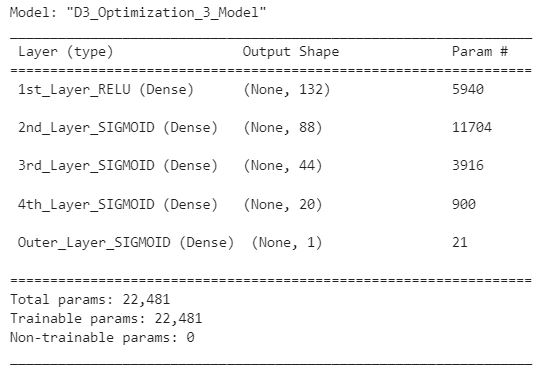
    * 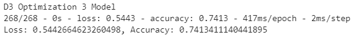
    * 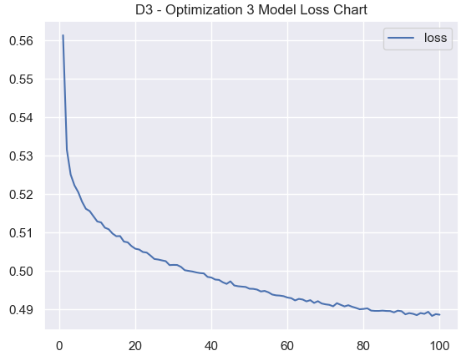
    * 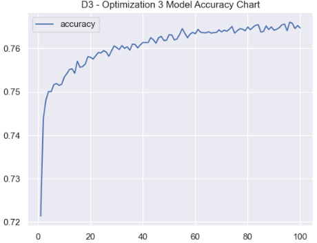
* D3 - Optimization 4 Model (78.69%)
    * Optimization Change: The previous D3_OPT_3 model increased it's accuracy, but still slightly shy of the 75% goal. All changes from the previous model were kept with the exception of the manner in which the NAME feature was binned, the activiation functions, the removal of the 4th layer. Instead of having several values types, the NAME feature was binned at any value with less than or equal to 5 would be put into an "Other" category. The activation function for the 2nd and 3rd layer were changed back to RELU from SIGMOID. The model was able to surpass the 75% accuracy goal.
    * 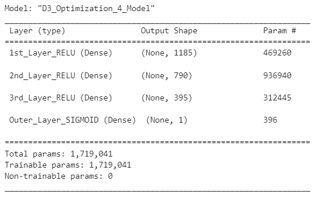
    * 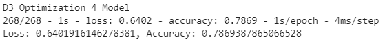
    * 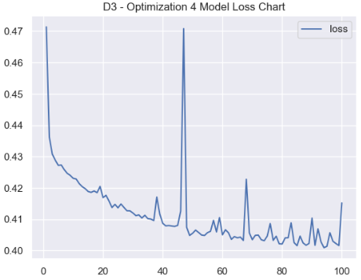
    * 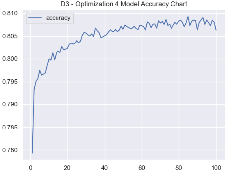

## Summary
The process of trial and error refinement, training, and testing was arduous using the Neural Network method. Although, we achieve an accuracy of 78.69%, it took 4 passes to get.

### Recommendation
One posible method to utilize would be the Random Forest Classifier. This method was tested. Within a matter of seconds, a model was created reaching the same/simiar accuracy rate. Further more, an ordered list of important features can be produced.

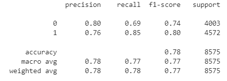

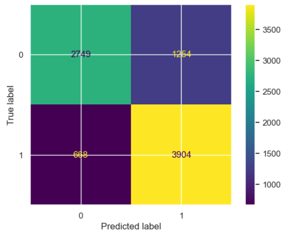

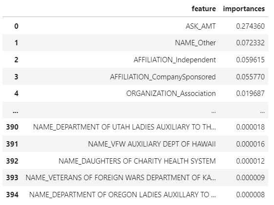

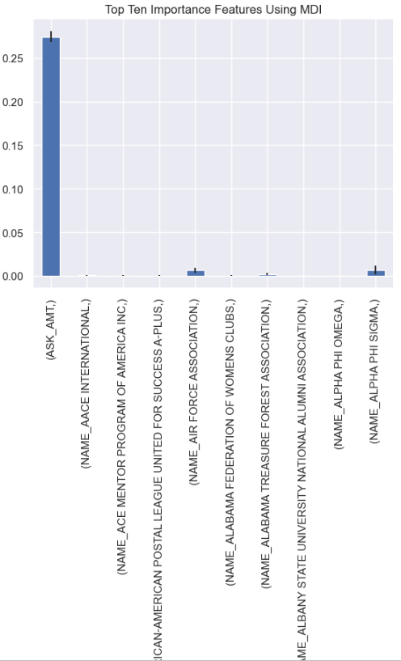
